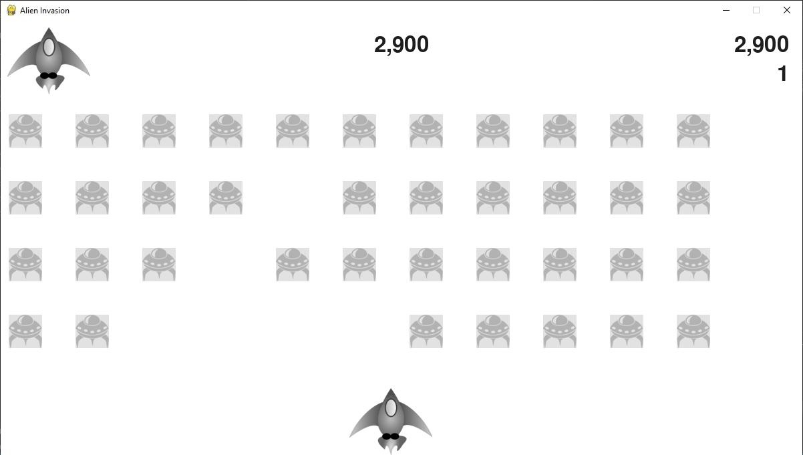

# ALIEN INVASION GAME BUILT WITH PYTHON

### Description

- You move a spaceship while firing bullets at a fleet of alien ships that is trying to attack you
- Objective is to takedown as many aliens as you can to prevent them from reaching the base  
- For each alien ship that you take down you are given points 
- The player will have 3 lives per game and each time the alien invaders reach the base the player will loose one life
- When you loose all the three lives it will be game over

### Screenshot

